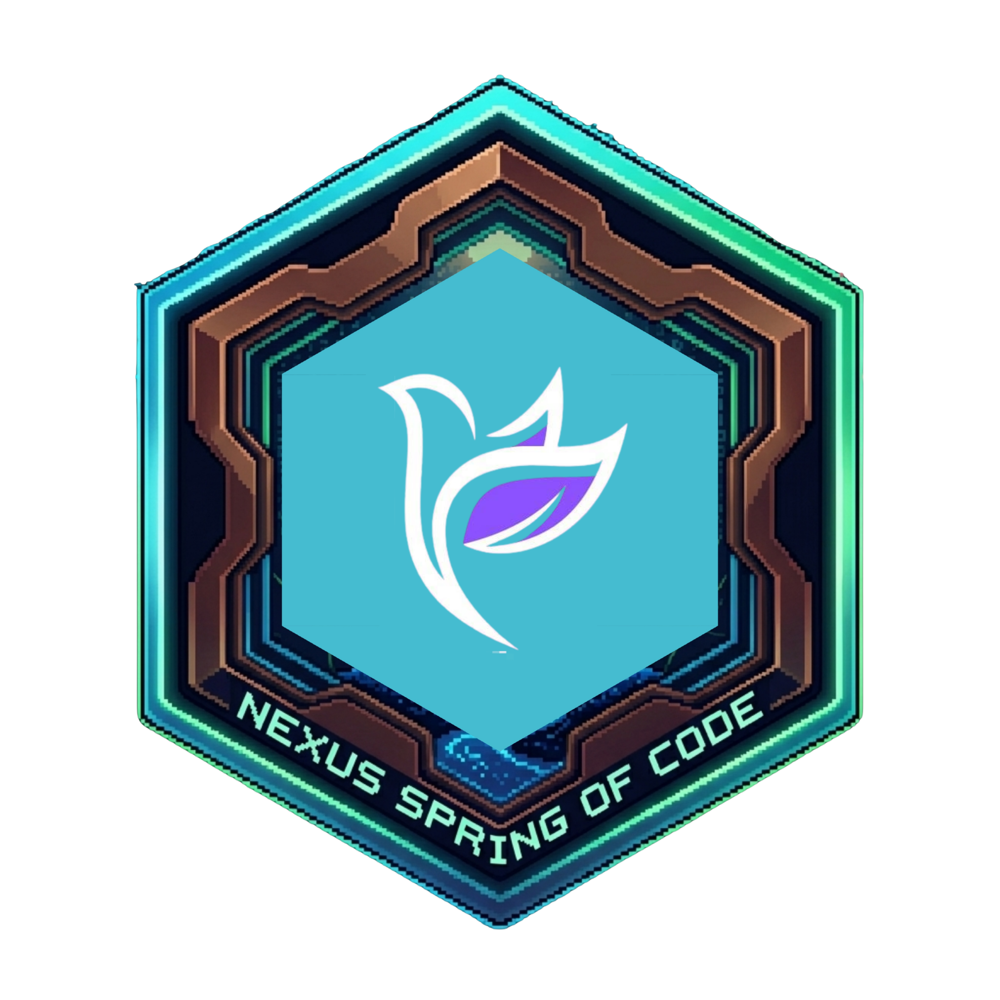

<p align="center">
  <a href="https://nsoc.in/">
    
  </a>
</p>

<p align="center">
  🚀 <b>This project is officially participating in NSoC</b>
</p>


# DSA Interview Coach


DSA Interview Coach is a full-stack AI chatbot web application for practicing Data Structures and Algorithms interview questions through a mock interview experience. It uses Next.js App Router, TypeScript, Tailwind CSS, and the Gemini API to create a ChatGPT-style interview workflow around Striver SDE Sheet inspired questions.

## Live Demo

[Try the DSA Interview Coach](https://dsa-interview-coach.vercel.app)

## Why I Picked This Topic

I chose this topic because I personally faced challenges while preparing for DSA interviews. During my preparation, I realized that having someone available to take mock interviews anytime would have been extremely helpful for practicing how to think aloud, explain approaches, and handle follow-up questions. DSA interview preparation is a common challenge for many students and developers. While most platforms provide lists of problems and solutions, they rarely replicate the experience of a real interview. This project aims to bridge that gap by creating a conversational AI experience where users can practice step by step in an interview-like environment.

## What I Built

- This is a web application, DSA Interview Coach, that simulates real DSA technical interviews.
- The AI acts as an interviewer, asking problems and adaptive follow-up questions based on the candidate’s responses.
- Provides progressive hints and guidance to help users think through the problem without directly revealing the solution.
- Conducts a complete mock interview flow, probing the approach and naturally wrapping up the session like a real interviewer.

## Features

- ChatGPT-style friendly chat UI
- Welcome screen with quick-start interview actions
- Gemini-powered mock interview prompts with staged interview behavior
- Mock interview flow that asks for approach first, then time complexity, then space complexity, then optimizations
- Gradual hint system that avoids revealing the full solution too early
- Full solution reveal only when the user explicitly asks for it
- Striver SDE Sheet inspired dataset with 30+ DSA interview questions
- Loading indicator, reset chat action, timer functionality, and API error handling

## Tech Stack

- Next.js (App Router)
- TypeScript
- Tailwind CSS
- Gemini API via `@google/generative-ai`


## Dataset Source

The dataset is inspired by the Striver SDE Sheet and includes interview-style questions across:

- Arrays
- Strings
- Linked Lists
- Binary Trees
- Graphs
- Dynamic Programming

The dataset lives in [/Users/priyanka/Documents/Projects/ThinklyLab/data/striverQuestions.ts](./data/striverQuestions.ts).

## Project Structure

```text
/app
  /api
    /auth
      /[...nextauth]
        route.ts
    /chat
      route.ts
    /user
      /signup
        route.ts
      /logout
        route.ts
      /profile
        route.ts
      /changepassword
        route.ts
      /forgotpassword
        route.ts
      /resetpassword
        route.ts
      /verifyemail
        route.ts
  /user
    /login
    /signup
    /profile
    /resetpassword
    /forgotpassword
    /verifyemail
  page.tsx


/components
  ChatMessage.tsx
  ChatInput.tsx
  SuggestionButtons.tsx
  Header.tsx
  AppToaster.tsx
  AuthProvider.tsx
  Navbar.tsx

/data
  striverQuestions.ts
/db
  db.ts
/helpers
  helperFunctions.ts
  mailer.ts
  sessionTypes.ts
/models
  UserModel.ts
/lib
  gemini.ts
```

## How To Run Locally

1. Install dependencies:

```bash
npm install
```

2. Create your environment file:

```bash
cp .env.local.example .env.local
```

3. Add your Gemini API key in `.env.local`:

```bash
GEMINI_API_KEY=your_actual_key_here
GEMINI_MODEL=gemini-2.5-flash
MONGO_URI=your_mongo_uri
NEXTAUTH_URL=https://dsa-interview-coach.vercel.app/
NEXTAUTH_SECRET=your_auth_secret
EMAIL_USER=your_google_app_password_email
EMAIL_PASS=your_google_app_password_code
GOOGLE_CLIENT_ID=your_google_oauth_client_id
GOOGLE_CLIENT_SECRET=your_google_oauth_secret
GITHUB_CLIENT_ID=your_github_oauth_client_id
GITHUB_CLIENT_SECRET=your_github_oauth_secret
```

4. Start the development server:

```bash
npm run dev
```

5. Open:

```text
http://localhost:3000
```
## Google OAuth Setup 
  1. Open Google Cloud Console → APIs & Services → OAuth consent screen — configure (External, add your email, save).
  2. APIs & Services → Credentials → Create Credentials → OAuth client ID → Application type: Web application.
  3. Set Authorized redirect URI: https://dsa-interview-coach.vercel.app/api/auth/callback/google
  4. Create and copy the Client ID → paste into GOOGLE_CLIENT_ID and Client secret → paste into GOOGLE_CLIENT_SECRET.
## Github OAuth Setup 
  1. GitHub → Settings → Developer settings → OAuth Apps → New OAuth App.
  2. Homepage URL: https://dsa-interview-coach.vercel.app
  3. Authorization callback URL: https://dsa-interview-coach.vercel.app/api/auth/callback/github
  4. Register app, then copy Client ID → GITHUB_CLIENT_ID and generate/copy Client Secret → GITHUB_CLIENT_SECRET.

## Environment Variables

- `GEMINI_API_KEY`: your Google Generative AI API key
- `GEMINI_MODEL`: optional Gemini model override, defaults to `gemini-2.5-flash`
- MONGO_URI=your mongodb uri
- NEXTAUTH_URL=https://dsa-interview-coach.vercel.app/
- NEXTAUTH_SECRET=your_auth_secret
- EMAIL_USER=your_google_app_password_email
- EMAIL_PASS=your_google_app_password_code
- GOOGLE_CLIENT_ID=your_google_oauth_client_id
- GOOGLE_CLIENT_SECRET=your_google_oauth_secret
- GITHUB_CLIENT_ID=your_github_oauth_client_id
- GITHUB_CLIENT_SECRET=your_github_oauth_secret

## Deployment On Vercel

1. Push the project to GitHub.
2. Import the repository into Vercel.
3. Add the `GEMINI_API_KEY` environment variable in the Vercel project settings.
4. Optionally add `GEMINI_MODEL=gemini-2.5-flash`.
5. Deploy.

## Notes

<!-- - The mock interview route is implemented in [/Users/priyanka/Documents/Projects/ThinklyLab/app/api/chat/route.ts](./app/api/chat/route.ts). -->
- Gemini responses are generated with `GEMINI_MODEL` or default to `gemini-2.5-flash`.


## Contributing


Please read [CONTRIBUTING.md](./CONTRIBUTING.md) before contributing.
